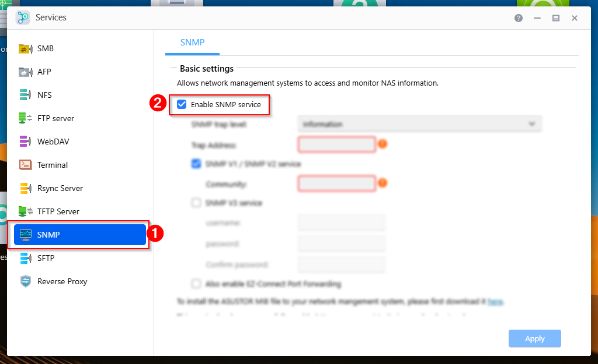
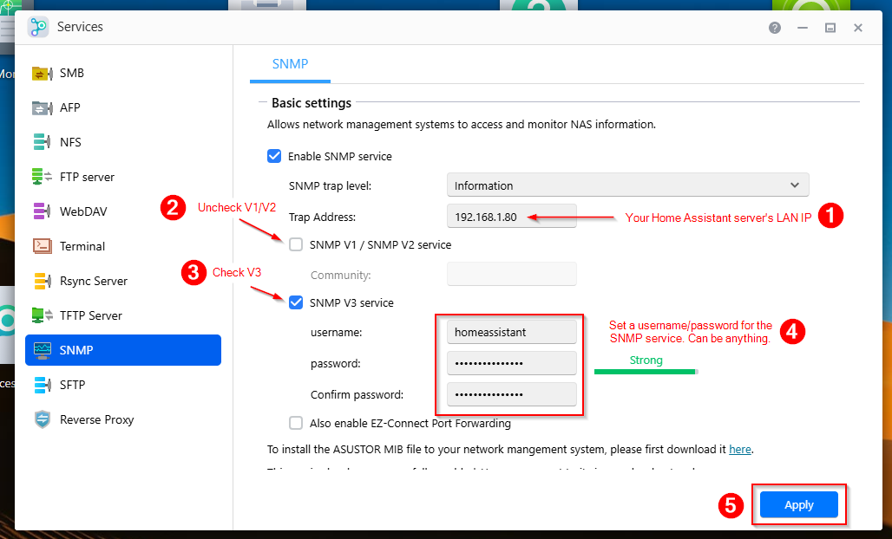
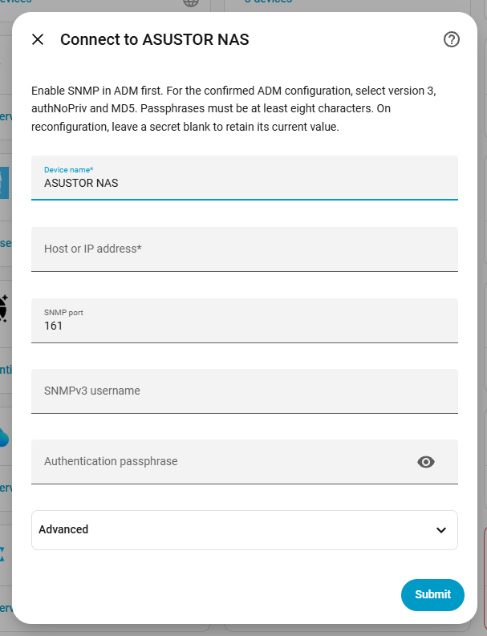
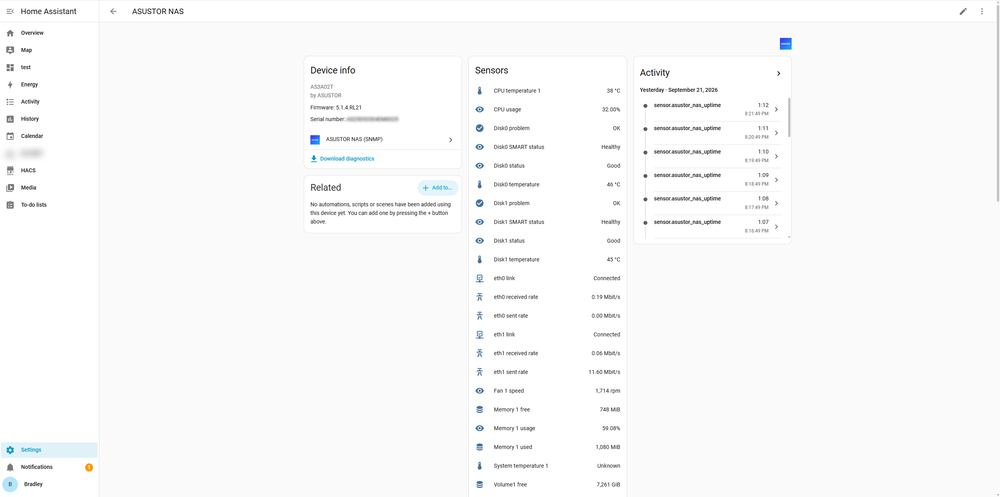

<div align="center">

  

<h1>ASUSTOR NAS (SNMP)</h1>
<h3>Home Assistant integration for automatically detecting and exposing ASUSTOR devices using SNMPv3.</h3>

<p align="center">
    <a href="https://hacs.xyz">
      
    </a>
    <a href="https://github.com/bradleyhodges/hacs-asustor-snmp">
				
    </a>
    <a href="https://github.com/bradleyhodges/hacs-asustor-snmp/releases/latest">
			
    </a>
    <a href="https://github.com/bradleyhodges/sfsymbols/blob/stable/LICENSE">
				
    </a>
</p>

<p align="center"><b>hacs-asustor-snmp</b> is a local, read-only <a href="https://www.home-assistant.io/">Home Assistant</a> integration for ASUSTOR NAS. Enables automatic discovery of ASUSSTOR NAS' on the network, and exposes all available device performance and telemetry metrics in Home Assistant.</p>

<p align="center">
    <a href="#-installation">🚀 Installation</a>
  • <a href="#enabling-snmpv3-on-your-asustor-nas">Enabling SNMPv3</a>
  • <a href="#configuration">Configuration</a>
  • <a href="#-getting-started">Getting Started</a>
  • <a href="https://github.com/bradleyhodges/sfsymbols/issues">Issues</a>
  • <a href="https://github.com/bradleyhodges/sfsymbols/pulls">Pull Requests</a>
</p>
</div>

<p align="center"><a href="https://www.buymeacoffee.com/bradleyhodges" target="_blank"></a></p>

## 🚀 Installation

### With HACS
1. Add this repo as a [custom repository](https://hacs.xyz/docs/faq/custom_repositories/).
   It should then appear as a new integration. Click on it. If necessary, search for "<i>ASUSTOR</i>".

   ```text
   https://github.com/bradleyhodges/hacs-asustor-snmp
   ```
   Or use this button:

   [](https://my.home-assistant.io/redirect/hacs_repository/?owner=bradleyhodges&repository=hacs-asustor-snmp&category=integration)
   
2. Click the blue Download button in the bottom right corner of the screen to install the integration.

### Manual Installation (Docker)
<details>
<summary>Click here to show manual install instructions</summary>

You can optionally choose to install the integration manually:

1. Download `ASUSTOR-SNMP-1.0.0.zip` to the **machine running Home Assistant**.
    Extract it:

    ```bash
    unzip ASUSTOR-SNMP-1.0.0.zip -d asustor-snmp-1.0.0
    cd asustor-snmp-1.0.0
    ```

2. Check the container name and locate its configuration directory:
    ```bash
    sudo docker ps --format 'table {{.Names}}\t{{.Image}}'
    HA_CONTAINER=homeassistant
    HA_CONFIG_DIR="$(sudo docker inspect "$HA_CONTAINER" --format '{{range .Mounts}}{{if eq .Destination "/config"}}{{.Source}}{{end}}{{end}}')"
    printf 'Home Assistant configuration: %s\n' "$HA_CONFIG_DIR"
    ```

3. Change `HA_CONTAINER` if your container has a different name. Check that the printed directory is your existing HA configuration directory. Then install:
    ```bash
    sudo python3 install.py --config-dir "$HA_CONFIG_DIR"
    sudo docker restart "$HA_CONTAINER"
    ```

    The installer needs Python 3.10+ on the host. It verifies the staged files,
    preserves any previous version outside `custom_components`, and restores the
    previous directory if replacement fails. It does not edit `configuration.yaml`
    or restart HA itself. The final command above explicitly restarts the container.
    Do not run the installer inside the container with the host path.

    Alternatively, copy **only** the supplied `custom_components/asustor_snmp`
    directory to your HA configuration's `custom_components` directory, then restart
    HA. The resulting path inside the container must be: `/config/custom_components/asustor_snmp/manifest.json`

    Home Assistant installs the declared PySNMP dependency automatically; it needs
    outbound access to its configured Python package index during first setup.
    There is no need to install Net-SNMP commands or upload the vendor MIB files.
</details>

## Enabling SNMPv3 on your ASUSTOR NAS
If you have never used SNMPv3 on your NAS, you'll need to enable the service in the ASUSTOR Data Master [(ADM) web interface](https://www.asustor.com/en-gb/knowledge/detail/?id=&group_id=1028):

1. Sign in to ADM with your ASUSTOR NAS Administrator user.

2. Launch the Services applet:


3. Click on the SNMP service in the sidebar and ensure the **`Enable SNMP Service`** option is checked:


4. Set the **`Trap Address`** to your Home Assistant's server IP (*This value doesn't actually matter for our purposes, but ADM requires a valid IP to be given here.*). Uncheck the **`SNMP V1 / SNMP V2 service`** option and check the **`SNMP V3 service`** option. Enter a username and password for the SNMP service (*doesn't need to match your Home Assistant credentials*). Click Apply.


That's it! Once SNMP is enabled, the Home Assistant integration will be able to communicate with your NAS.

## Configuration

After installing the integration and restarting Home Assistant, you will need to configure the integration. This only needs to be done once:

[](https://my.home-assistant.io/redirect/config_flow_start?domain=asustor_snmp)

Alternatively, go to **Settings → Devices & services** and click the **`Add integration`** button.
Find or search for **ASUSTOR NAS (SNMP)**, click on it, and follow the prompts.

To connect to your ASUSTOR NAS, enter your Device name, Host/IP, SNMP Port, username, and password. For most NAS', the authentication parameters will not be required:



> [!NOTE]
>  The hostname/IP must be reachable **from the HA container**. A successful walk on a different machine does not itself prove that routing/firewall path works.

## What appears in Home Assistant

One NAS device groups the discovered entities. Names and counts vary with the
NAS and its supported MIB rows.



| Group | Entities |
|---|---|
| System | Overall CPU usage, per-core usage, CPU/system temperatures, fan RPM, memory total/free/used/usage, vendor-reported free percentage, uptime, ADM/BIOS version, timezone, ADM update status and availability |
| Each disk bay | Disk status, SMART status, problem indication, temperature, capacity; model and interface attributes |
| Each volume | Health status, problem indication, total/free/used capacity, usage percentage; RAID level and filesystem attributes |
| Each interface | Link status, link speed, RX/TX rate, raw received/sent byte counters, errors and discards where present |
| UPS, when enabled | Status, on-battery and low-battery states, battery charge, remaining runtime and input voltage |

Per-core values, static capacities, raw counters, link speeds and other noisy
or secondary diagnostics are disabled by default. Enable them from the device's
entity list. Invalid/unsupported readings are unknown; removed table rows are
unavailable. New table rows are discovered automatically on a successful poll.
Entities representing removed hardware remain in the registry to preserve user
customisations; remove unwanted entities manually.

Disk identity follows the **bay/index**, because this MIB supplies no disk serial.
Replacing a disk in the same bay retains that bay's entities and history. Network
identity follows `ifName`; rate baselines additionally check interface index and
MAC address. Renaming an interface creates a new set of entities.

## Advanced configuration

<details>
<summary>Monitoring options and semantics</summary>

Open the integration's **Configure** action to adjust:

- Polling interval: 30 seconds by default; 15–3,600 seconds supported.
- Per-request timeout: 3 seconds by default; 1–10 seconds supported.
- Request retries: one by default; zero to three supported.
- Virtual interfaces: excluded by default, including loopback and Docker bridges.
- UPS monitoring: off by default. Enable it only when you have a UPS. Rows with
  neither a manufacturer nor a model are ignored even when enabled. Your sample
  contained an unidentified all-zero row with `OB`, so exposing it as a real UPS
  would have created a misleading alarm.
- Storage and memory units, as explained below.

SNMP tables are limited to 4,096 values and 512 requests per walk. Vendor polling
has a 25-second deadline; optional network polling has 15 seconds, within a
45-second overall deadline. These bounds take precedence over individual retry
settings. Polls are serialised. Large/slow NAS installations may need a longer
polling interval; raising the per-request timeout does not remove the deadlines.

**Storage units:** the vendor MIB says GB, but the observed `7452` reading for an
8 TB drive is consistent with GiB. The integration therefore defaults to **GiB**.
This is an explicit inference from your hardware/readings. Select GB if your
firmware reports decimal gigabytes. Values retain the NAS's integer precision;
this is not byte-exact capacity accounting.

**Memory units:** the vendor MIB omits a unit. The default **MiB** is inferred from
the observed `1828` total; MB is available as an option. Used memory is
`total − vendor free`; usage is derived from those two readings. Vendor free
memory is not claimed to be Linux `MemAvailable`, and it may differ from another
monitor's treatment of filesystem cache. The vendor's rounded free percentage
is a separate disabled diagnostic.

**Network rates:** RX means traffic received by the NAS; TX means traffic sent by
it. Rates use the difference between 64-bit octet counters divided by actual
monotonic elapsed time, expressed in Mbit/s. The first poll is unknown. Baselines
reset after failures, counter decreases, SNMP-agent restarts, discontinuities,
interface identity changes or excessive gaps. If the uptime/counters required to
establish continuity are absent, rates remain unknown. 32-bit counters are not
used as a throughput fallback on fast links. Raw total byte counters are optional
diagnostics without a statistics state class: interface replacement must not
create fictitious lifetime traffic in HA's long-term statistics.

**Health and updates:** fault sensors turn on only for explicitly recognised
failure states, and off only for recognised healthy states. Unrecognised or
localised strings remain unknown; the raw status sensor remains available. ADM
update availability is informational only: no firmware-install action is exposed.
Uptime is the vendor's human-readable string, not a guessed boot timestamp.
</details>

## Connection changes and troubleshooting

Use the integration menu's **Reconfigure** action to change the host or SNMP
settings. Leave a secret blank to retain it; irrelevant secrets are removed when
changing security modes. The NAS serial must remain the same. An explicit USM
credential rejection starts HA reauthentication; a silent rejection may appear
as a connection timeout because some SNMP agents do not return an error report.

<details>
<summary>Integration missing after restart</summary>
- confirm the exact `manifest.json` path.
- refresh the browser.
- check HA logs for `custom_components.asustor_snmp`.
</details>

<details>
<summary>Cannot connect</summary>
- check UDP/161 routing from the HA container and the NAS SNMP service. Use the authentication mode above. A non-default context can also restrict the visible OIDs.
</details>

<details>
<summary>Unexpected host/device</summary>
- identity requires ASUSTOR serial and model OIDs to be readable.
- setting up a different NAS requires a separate integration entry.
</details>

<details>
<summary>Network entities unavailable but disk/system sensors work</summary>
- check access to IF-MIB and IF-MIB's extended counters. Optional network failure or view denial does not discard otherwise valid vendor telemetry.
</details>

<details>
<summary>Unknown system temperature</summary>
- your NAS does not support the system temperature MIB.
</details>

<details>
<summary>Credentials not working</summary>
- PySNMPaccepts Latin-1 characters. Non-latin characters are not allowed.
- usernames and context names are limited to 32 bytes. 
- passwords need at least eight characters.
</details>

<details>
<summary>Diagnostics</summary>
- download diagnostics from the integration menu. The output is allowlisted and omits credentials, host, serial, MACs, names and raw telemetry.
</details>


## Development and sources

### Use of AI
This integration was created with the help of [Codex](https://openai.com/codex/) (GPT 5.6 Sol) as this is my first Home Assistant integration. The ASUSTOR MIB mappings would have taken a prohibitively significant amount of time and effort to map by hand, and so Codex was a particularly useful companion in this aspect.

### Compiling and testing

Python 3.14 is required for the test environment:

```bash
python3.14 -m venv .venv
.venv/bin/pip install -r requirements-test.txt
.venv/bin/python -m pytest -q --cov=custom_components.asustor_snmp
.venv/bin/ruff check .
```

## Further reading

- [Home Assistant coordinator documentation](https://developers.home-assistant.io/docs/integration_fetching_data/)
- [Home Assistant config-flow documentation](https://developers.home-assistant.io/docs/config_entries_config_flow_handler/)
- [HA 2026.9.2 SNMP dependency](https://github.com/home-assistant/core/blob/2026.9.2/homeassistant/components/snmp/manifest.json)
- [PySNMP 7.1.27 asyncio implementation](https://github.com/lextudio/pysnmp/blob/v7.1.27/pysnmp/hlapi/v3arch/asyncio/cmdgen.py)
- [IF-MIB counter semantics, RFC 2863](https://www.rfc-editor.org/rfc/rfc2863.html)
- [ASUSTOR SNMP guidance](https://www.asustor.com/en/online/College_topic?topic=271)